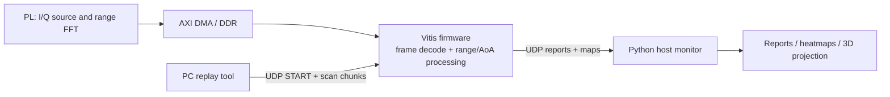
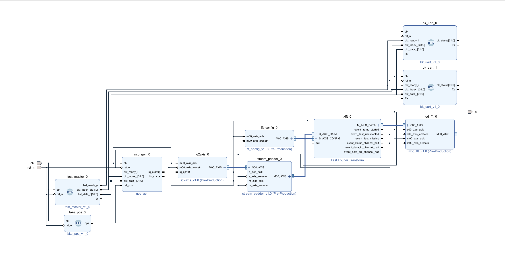
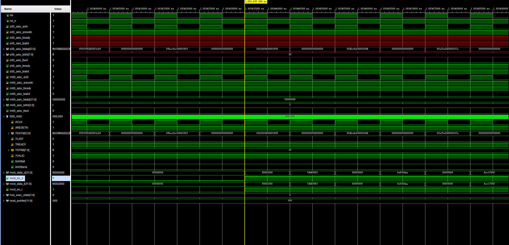
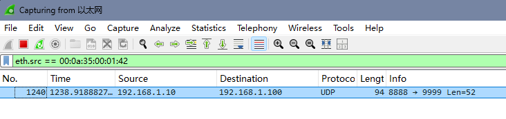
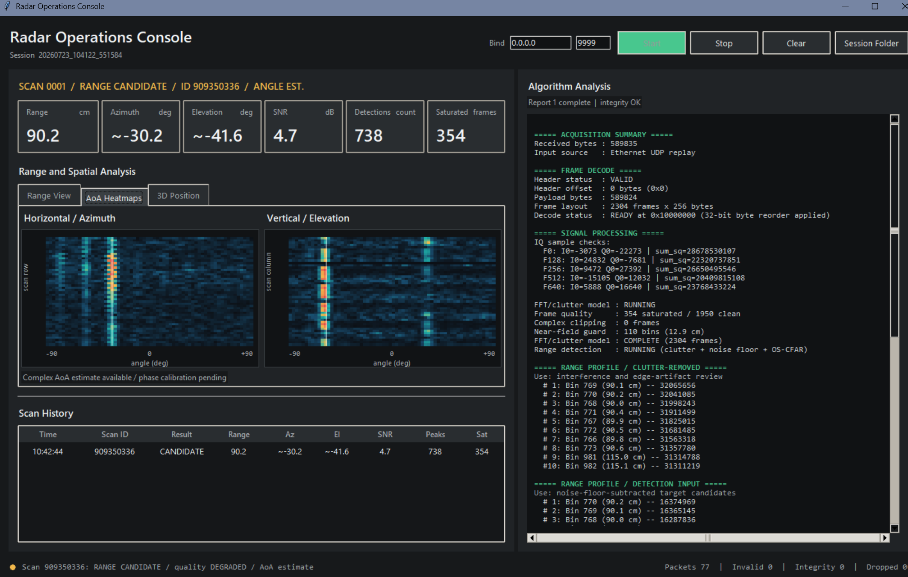

# Zynq FMCW Radar Collection and Processing System

[中文](#项目概述) | [Architecture](#architecture) | [Validation](#validation) | [Repository layout](#repository-layout)

## Project overview

This repository contains a Zynq-based FMCW radar collection and processing system.
The FPGA fabric produces complex I/Q range-spectrum data. The bare-metal Vitis
application receives a scan through Ethernet UDP, performs frame validation,
clutter suppression, range detection, CFAR analysis, and planar-array spatial
processing, then sends a structured report to a Python host application.

The repository combines the FPGA hardware project, bare-metal Vitis firmware,
UDP replay/report tools, raw captures, tests and the Python monitoring console.

### Implemented capabilities

- 64 real complex samples per array element, zero-padded to a 2048-point range FFT.
- 48 x 48 planar-array data organization and 48-point spatial processing.
- Frame header validation, 32-bit byte reordering, saturation rejection, near-field
  guarding, clutter suppression, noise-floor processing, CFAR and range interpolation.
- UDP `START` / `READY` / data / report / `PROCESS DONE` scan session protocol with
  chunk ordering, CRC validation, duplicate suppression and report reassembly.
- Python monitoring application with structured reports, range/angle visualizations
  and 3D point projection.
- Offline regression tests for capture classification, protocol handling, host service
  behavior and visualization calculations.

## Validation results

The system was exercised with the three captures in `vitis/radarcollect/` and with
the board-side UDP workflow. The current offline suite contains 27 passing tests.

Spatial processing retains complex I/Q phase and produces phase-based azimuth and
elevation estimates together with range, quality and spectrum information. See
[`docs/CAPTURE_ALGORITHM_AUDIT.md`](docs/CAPTURE_ALGORITHM_AUDIT.md) and
[`docs/SYSTEM_VALIDATION.md`](docs/SYSTEM_VALIDATION.md).

## Architecture



## Demonstration

The following captures show the implemented PL stream path, UDP report delivery
and host-side range/angle visualization workflow.

| FPGA data path | AXI-stream timing |
| --- | --- |
|  |  |

| UDP report transport | Host monitoring console |
| --- | --- |
|  |  |

## Offline quick start

The offline tools require Python 3.10+ and NumPy. No FPGA board is required for
these commands.

```powershell
python -m pip install -r requirements-host.txt
python -m unittest discover -s tests -v
python vitis\radarcollect\audit_captures.py --no-cfar
```

Start the host monitor with:

```powershell
python radar_monitor.py
```

`udp_scan_replay.py` is the UDP replay client for sending a raw scan to the board.

## Hardware project

- `soc.tcl`, `b220.srcs/`, `ip/` and `vitis/radarcollect/src/` are source inputs.
- `soc_wrapper.xsa` is the platform export used by the Vitis application.
- Vivado caches, synthesis/implementation outputs, Vitis BSP exports, ELF/BIT files
  and IDE metadata are excluded from version control; the repository keeps the
  source inputs needed to reconstruct those artifacts in a matching Xilinx toolchain.

## Repository layout

| Path | Purpose |
| --- | --- |
| `b220.srcs/` | Vivado block designs, constraints, simulation source and HDL source |
| `ip/` | Custom packaged IP, including complex FFT output and stream padding blocks |
| `soc.tcl` | SoC construction script |
| `vitis/radarcollect/src/` | Bare-metal acquisition, UDP and signal-processing firmware |
| `vitis/radarcollect/*.txt` | Three raw capture datasets used by the offline audit |
| `radar_host/` | Host protocol, service, reporting, storage and visualization modules |
| `radar_monitor.py` | Desktop monitoring application entry point |
| `udp_scan_replay.py` | Board-targeted UDP scan replay tool |
| `tests/` | Offline unit and regression tests |
| `docs/` | Architecture, algorithm, host and release-boundary documentation |

## Validation

Run the complete offline test set before changing host-side code:

```powershell
python -m unittest discover -s tests -v
```

GitHub Actions runs this suite and the capture audit on every push. The workflow
repeats the host-side protocol, visualization and capture-processing checks.

## System documentation

| Document | Content |
| --- | --- |
| `docs/CAPTURE_ALGORITHM_AUDIT.md` | Capture characteristics, range evidence and spatial-processing results |
| `docs/COMPLEX_AOA_IMPLEMENTATION.md` | Complex I/Q interface, planar-array organization and angle-estimation flow |
| `docs/HOST_APPLICATION.md` | Monitoring console, session output and visualization views |
| `docs/SYSTEM_VALIDATION.md` | End-to-end workflow and current verification results |

## 项目概述

本项目实现了 Zynq 平台的 FMCW 雷达采集、Vitis 端处理、UDP 网络传输与 Python
上位机显示，覆盖复杂 I/Q 数据、距离处理、二维阵列空间处理、结构化报告、热力图和三维
结果展示。
