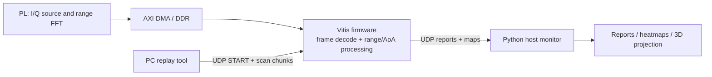

# Zynq FMCW Radar Collection and Processing System

[中文](#项目概述) | [Architecture](#architecture) | [Validation](#validation) | [Repository layout](#repository-layout)

## Project overview

This repository contains a Zynq-based FMCW radar collection and processing system.
The FPGA fabric produces complex I/Q range-spectrum data. The bare-metal Vitis
application receives a scan through Ethernet UDP, performs frame validation,
clutter suppression, range detection, CFAR analysis, and planar-array spatial
processing, then sends a structured report to a Python host application.

The hardware-facing source is a **frozen, hardware-validated baseline**. It is
published without functional refactoring because the development board is no
longer available for a new on-board regression run.

### Implemented capabilities

- 64 real complex samples per array element, zero-padded to a 2048-point range FFT.
- 48 x 48 planar-array data organization and 48-point spatial processing.
- Frame header validation, 32-bit byte reordering, saturation rejection, near-field
  guarding, clutter suppression, noise-floor processing, CFAR and range interpolation.
- UDP `START` / `READY` / data / report / `PROCESS DONE` scan session protocol with
  chunk ordering, CRC validation, duplicate suppression and report reassembly.
- Python monitoring application with structured reports, range/angle visualizations
  and 3D point projection.
- Offline regression tests for capture classification, protocol handling, host service
  behavior and visualization calculations.

## Verification scope and limitations

The baseline was exercised with the three captures in `vitis/radarcollect/` and with
the board-side UDP workflow. The current offline suite contains 27 passing tests.

The spatial result is an **uncalibrated angle estimate**, not a claimed physical
azimuth/elevation accuracy result. Known-angle captures and per-channel phase
calibration are required before reporting calibrated AoA accuracy. See
[`docs/CAPTURE_ALGORITHM_AUDIT.md`](docs/CAPTURE_ALGORITHM_AUDIT.md) and
[`docs/RELEASE_BASELINE.md`](docs/RELEASE_BASELINE.md).

## Architecture



## Offline quick start

The offline tools require Python 3.10+ and NumPy. No FPGA board is required for
these commands.

```powershell
python -m pip install -r requirements-host.txt
python -m unittest discover -s tests -v
python vitis\radarcollect\audit_captures.py --no-cfar
```

Start the host monitor with:

```powershell
python radar_monitor.py
```

`udp_scan_replay.py` is retained as the board-side UDP replay client. It requires
the validated board image and a reachable target IP; it is not part of the offline
test path.

## Hardware build boundary

- `soc.tcl`, `b220.srcs/`, `ip/` and `vitis/radarcollect/src/` are source inputs.
- `soc_wrapper.xsa` is the known platform export retained with this baseline.
- Vivado caches, synthesis/implementation outputs, Vitis BSP exports, ELF/BIT files
  and IDE metadata are intentionally not versioned. Regenerate them in a matching
  Xilinx toolchain after reviewing the hardware configuration.
- Do not alter the board-facing sources on the `hardware-validated` baseline without
  a fresh hardware regression.

## Repository layout

| Path | Purpose |
| --- | --- |
| `b220.srcs/` | Vivado block designs, constraints, simulation source and HDL source |
| `ip/` | Custom packaged IP, including complex FFT output and stream padding blocks |
| `soc.tcl` | SoC construction script |
| `vitis/radarcollect/src/` | Frozen bare-metal acquisition, UDP and signal-processing firmware |
| `vitis/radarcollect/*.txt` | Three raw capture datasets used by the offline audit |
| `radar_host/` | Host protocol, service, reporting, storage and visualization modules |
| `radar_monitor.py` | Desktop monitoring application entry point |
| `udp_scan_replay.py` | Board-targeted UDP scan replay tool |
| `tests/` | Offline unit and regression tests |
| `docs/` | Architecture, algorithm, host and release-boundary documentation |

## Validation

Run the complete offline test set before changing host-side code:

```powershell
python -m unittest discover -s tests -v
```

GitHub Actions runs this suite and the capture audit on every push. The workflow
does not build or modify FPGA/Vitis artifacts.

## Contribution rules

1. Keep hardware-facing changes separate from host-only changes.
2. Do not tune algorithm thresholds solely against the included three captures.
3. Add offline regression coverage for host protocol or visualization changes.
4. Treat hardware behavior as unverified after any PL, DMA, cache, linker, Vitis
   initialization or firmware processing change until it is tested on the board.

## 项目概述

本项目实现了 Zynq 平台的 FMCW 雷达采集、Vitis 端处理、UDP 网络传输与 Python
上位机显示。当前仓库中的板端代码为已经完成实测演示的冻结基线；在开发板不可用期间，
仅进行可离线验证的文档、测试、上位机和发布工程维护，不把未上板验证的改动标记为硬件有效。
